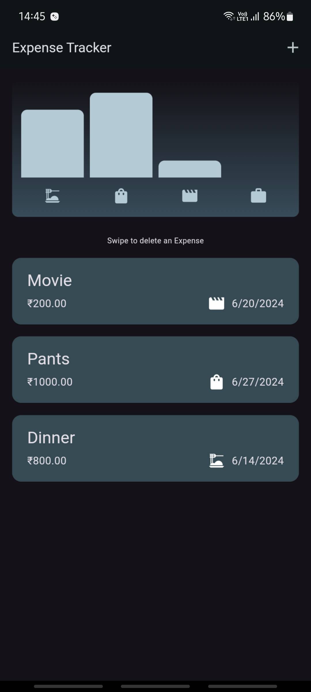

# Expense Tracker App

This Flutter application provides a user-friendly way to track and visualize your expenses. 

## Features

* **Add Expenses:** Easily input your expenses with details like amount, date, category, and title.
* **Categorization:**  Categorize expenses (food, shopping, fun, work) for better organization.
* **Visual Chart:**  A dynamic chart displays your spending distribution across categories.
* **Expense List:**  View a detailed list of all recorded expenses.
* **Delete Expenses:** Remove incorrect or unwanted expense entries.
* **Undo Deletion:** Recover accidentally deleted expenses with a convenient undo option.
* **Responsive Design:** Adapts seamlessly to different screen sizes for optimal viewing.

## Screenshots

